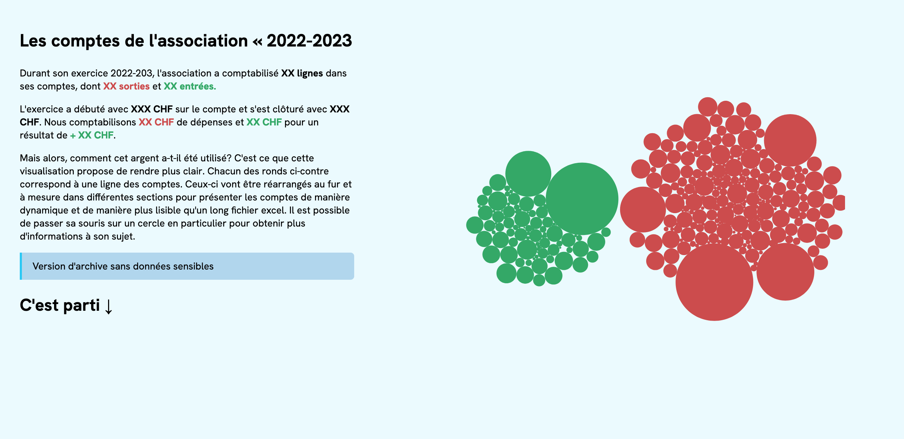
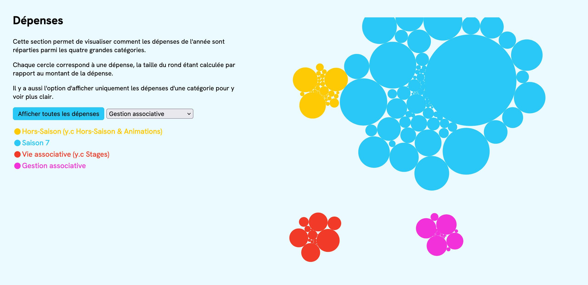
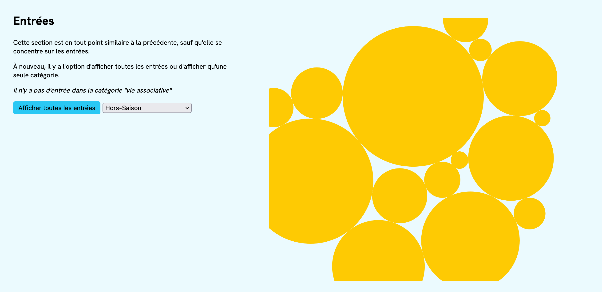
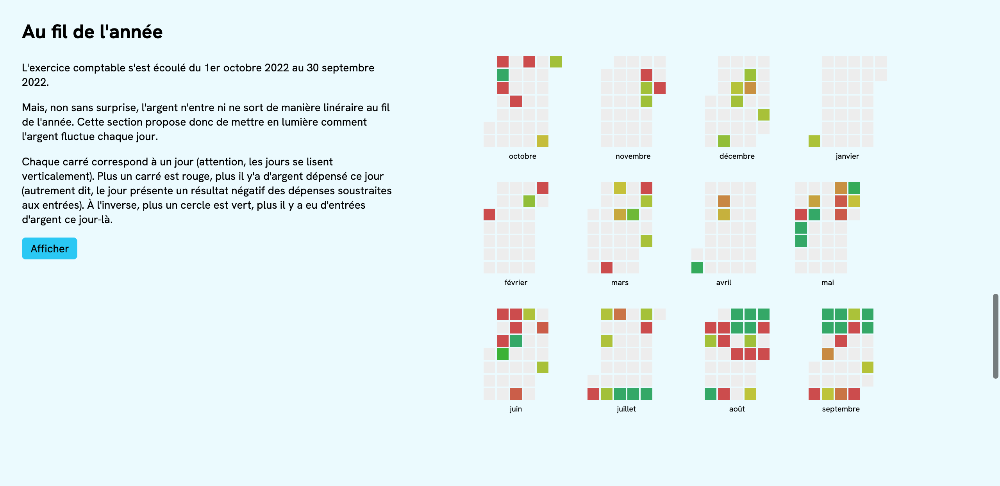
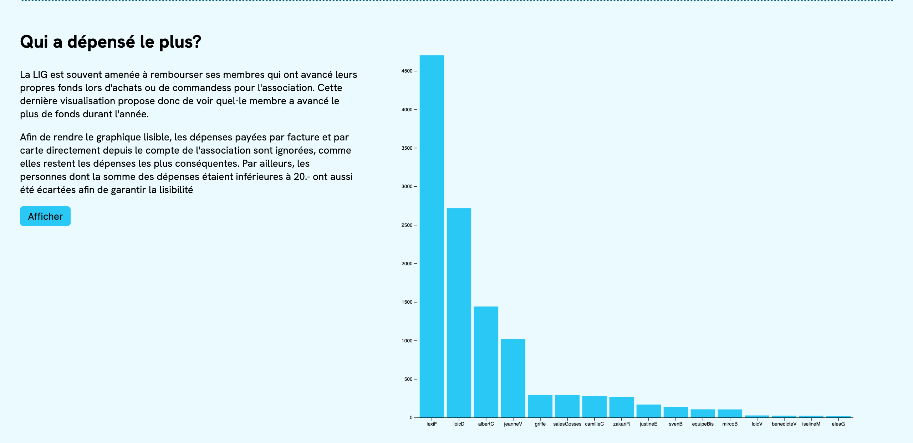

# Visualisation de données interactive pour les comptes d'une association
Cette visualisation interactive propose de dynamiser la présentation des comptes d'une association fictive pour son exercice 2022-2023. À chaque section, les chiffres sont présentés sous une nouvelle manière afin de faciliter leur compréhension et rendre la comptabilité plus ludique.

## Interface

### Accueil
L'accueil propose une vue d'ensemble. Des cercles sont générés à partir de deux centres, selon que ce sont des recettes ou des dépenses. Lors d'un hover sur un des cercles, une infobox donnant plus de détails sur la ligne comptable en question est générée. 

### Dépenses
La section _Dépenses_ permet de classer les dépenses de l'année selon les 4 grandes catégories, ou alors de se concentrer sur une seule catégorie pour générer des cercles rassemblés en sous-catégories

### Entrées
La section _Entrées_ est en tout point similaire à la section Dépenses, mais se concentre cette fois sur les recettes.

### Au fil de l'année
La section _Au fil de l'année_ génère un calendrier sous forme de Heatmap, qui permet de visualiser les jours selon les dépenses ou les entrées du jour. Plus un jour est rouge, plus il y a d'argent qui a été dépensé. À l'opposé, plus un jour est vert, plus il y a d'argent qui est entré. 

### Qui a dépensé le plus?
L'association rembourse souvent ses membres qui font des achats pour l'association. La section _Qui a dépensé le plus?_ génère un barchart qui classe les membres selon le montant qui leur a été remboursé au cours de l'année. 

## Accès
La visualisation est accessible via GitHub Pages [en suivant ce lien](https://livelaughlexi.github.io/comptesAsso).

Accessoirement, il est possible de télécharger une copie de ce repo, de l'ouvrir dans Visual Studio Code et d'accéder à la visualisation en localhost via le plugin LiveServer.

## Données
Ce projet mobilise deux jeux de données.

Le premier, _spendingData_ rassemble toutes les lignes comptables de l'année, classée selon leur _type_ (1 = dépense, 0 = entrée), leur _category_ (Hors-Saison, Saison 7, Vie associative et Gestion associative), leur _subCat_ (sous-catégorie), leur _amount_ (prix), leur _date_ et leur _paidBy_ (personne qui a effectué le paiement).

Le deuxième, _datesData_, généré à partir du premier, rassemble l'argent gagné, l'argent dépensé, et le total par jour. Il est utilisé pour la section _Au fil de l'année_

## Librairies, dépendances, ressources
Ce projet a été réalisé en JavaScript avec la [librairie d3](https://d3js.org/)

### Modules additionnels
* [Cal-Heatmap](https://cal-heatmap.com/) et ses plugins additionnels
  * [Legend](https://cal-heatmap.com/docs/plugins/legend)
  * [Tooltip](https://cal-heatmap.com/docs/plugins/tooltip), qui requiert sa propre dépendance [Popper](https://popper.js.org/)

### Inspiration & ressources de code
L'inspiration pour ce projet vient de la visualisation _What is the best (undergraduate) college major in the United States?_ par Cuthbert Chow. [Visualisation](https://cuthchow.github.io/college-majors-visualisation/) | [Repo GitHub](https://github.com/cuthchow/college-majors-visualisation).

La simulation de force et la génération des infobox ont été adaptées depuis son code, parfois avec l'aide de ChatGPT (cf. commentaires inline à l'intérieur du code)

### Autres ressources
* La police de caractères _HK Grotesk_, disponible sur [Google Fonts](https://fonts.google.com/specimen/Hanken+Grotesk)

## Autrice 
Ce projet a été réalisé par Lexi Fretz dans le cadre du cours _Visualisation de données_ donné par Isaac Pante (Section des Sciences du Langage et de l'Information, Faculté des Lettres, Université de Lausanne)

Version du code sans données sensibles pour l'archivage